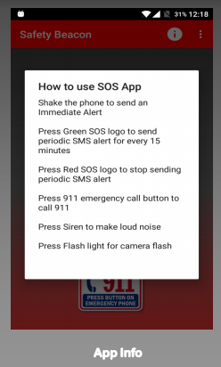

# Safety Beacon

#### Functionality

* Call 911 
* Alarm
* Siren 
* Flash
* Periodic texts on/off

#### Specification
* MIN SDK :21
* Android device : 5 or above
* Size: 2.85MB

#### Android and Google API :
* AlarmManager
* BatteryManager
* Camera
* Geocoder
* LocationServices
* MediaPlayer
* SensorManager
* SmsManager

